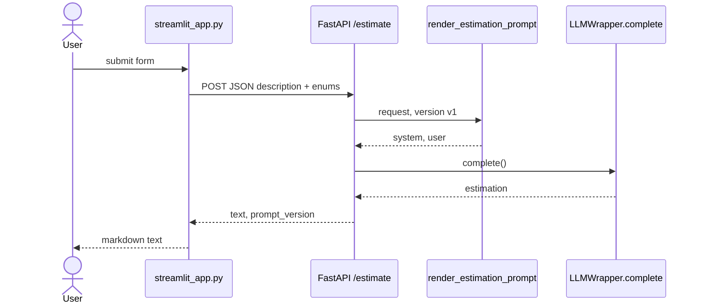

# Estimador CAG — Software estimation with AI

AI-powered software project estimation service using a **Cache Augmented Generation (CAG)** architecture.

The design and reference implementation this project follows come from the LiDR / Master **estimator** service (`ai-engineering-lidr/estimator`). This repo is a parallel student implementation with the same CAG approach.

## What is CAG and why use it

CAG (Cache Augmented Generation) injects relevant context directly into the LLM system prompt as static text. Here, reference estimations are inlined as examples — no vector database and no retrieval step.

That is a good first stage because:

- It is simple to implement and debug
- It needs no extra infrastructure (embeddings, vector stores)
- It works well when the context volume is small (a handful of examples)

Later modules of the Master are expected to evolve this kind of service toward **RAG** (Retrieval Augmented Generation) with a vector store when the example set grows.

## Requirements

- Python **3.11+**
- [uv](https://docs.astral.sh/uv/)
- An **API key** for OpenAI and/or Anthropic (at least one; both if you want provider fallback)
- **Redis** if you want the exact-match cache (the API still answers if Redis is down)

## Local setup

Dependencies are declared in `pyproject.toml` and locked in `uv.lock`. `uv sync` installs that set into `.venv`.

```bash
cd estimador-cag
uv sync
cp .env.example .env
# Edit .env and set the API key for your chosen provider
```

Run the API (same layout as the VS Code launch config: app package root is `src/`):

```bash
cd src
uv run uvicorn main:app --reload
```

Service: `http://localhost:8000`  
Swagger: `http://localhost:8000/docs` · ReDoc: `http://localhost:8000/redoc` · Health: `GET /health`

## Docker

```bash
cd estimador-cag
cp .env.example .env   # if needed
docker compose up --build
```

- API: [http://localhost:8000](http://localhost:8000)
- Redis: `redis://localhost:6379`

Compose sets `REDIS_URL=redis://redis:6379` for the API container. When you run uvicorn on the host, keep `redis://localhost:6379` in `.env`.

Streamlit still runs on the host (not inside Compose):

```bash
uv run streamlit run streamlit_app.py          # form → POST /estimate — API must be up
```

## HTTP client

Streamlit is the HTTP client of `POST /estimate`.

### Streamlit (HTTP form)

Needs the API running. Submit sends `description` plus the three enums to `POST /estimate` and paints `text`.



## Project layout

```
estimador-cag/
├── src/
│   ├── main.py                 # FastAPI app, /health
│   ├── config.py               # Pydantic Settings
│   ├── dependencies.py         # wrapper + Redis cache singletons
│   ├── routers/estimations.py  # POST /estimate
│   ├── services/               # LiteLLM wrapper, cache, CAG, evaluation
│   ├── schemas/estimation.py
│   └── context/examples.py
├── streamlit_app.py            # HTTP form → POST /estimate
├── Dockerfile
├── docker-compose.yml
├── pyproject.toml
├── uv.lock
└── .env.example
```

# Notes

## Test

### FastAPI

curl -X POST http://localhost:8000/api/v1/estimate \
  -H "Content-Type: application/json" \
  -d '{
    "description": "En la reunión con el equipo de marketing, el cliente explicó que necesita una landing page con formulario de contacto, integración con su CRM actual (HubSpot), y una sección de blog con editor WYSIWYG. El plazo ideal sería tenerlo listo en 4 semanas. El diseño ya existe en Figma.",
    "project_type": "web_saas",
    "detail_level": "medium",
    "output_format": "phases_table"
  }' -o salida.json

# Optional: POST /api/v1/estimate?prompt_version=v2  (default is v1)

jq -r '.text' salida.json > estimacion-limpia.md

### Form HTTP client (API must already be running)
uv run streamlit run streamlit_app.py

## Future improvements

### evaluation.py

  • bool(hours_match) / bool(cost_match) treats None as fail. If the table does not parse, those two checks drag the score down even though hours_match/cost_match stay None and
    no mismatch issue is logged. That is a harsh scorer, not a missing feature.
  • Costs are parsed with _to_int (digits only) while the schema types them as float. 1.234,56 vs 1,234.56 can go wrong the same way in both.
  • has_duration_section is true if the word week/weeks appears anywhere. Cheap heuristic. Same in both.

