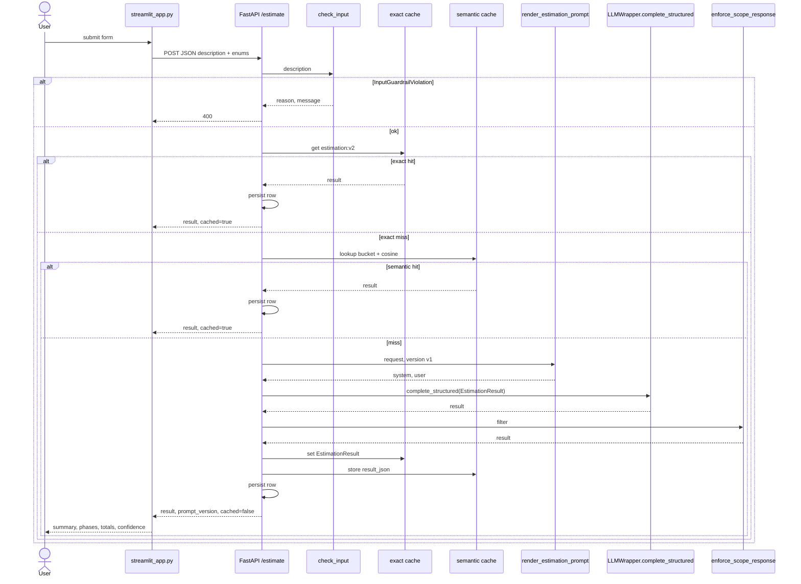
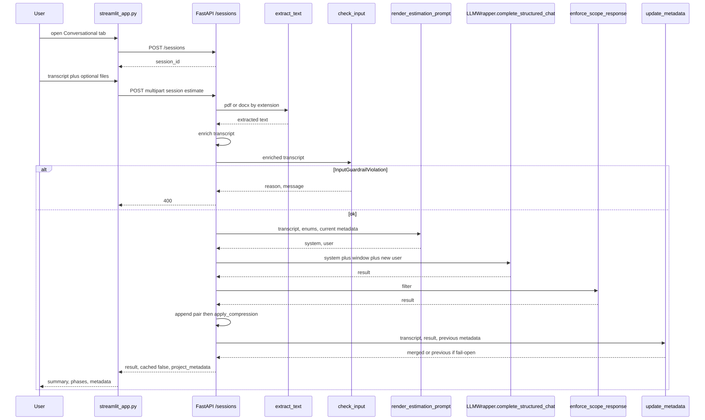

# Estimador CAG — Software estimation with AI

AI-powered software project estimation service using a **Cache Augmented Generation (CAG)** architecture.

The design and reference implementation this project follows come from the LiDR / Master **estimator** service (`ai-engineering-lidr/estimator`). This repo is a parallel student implementation with the same CAG approach.

## What is CAG and why use it

CAG (Cache Augmented Generation) injects relevant context directly into the LLM system prompt as static text. Live few-shot examples live in the Jinja templates (`prompts/estimation/v1|v2/examples.j2`) — no vector store and no retrieval step.

That is a good first stage because:

- It is simple to implement and debug
- It needs no extra infrastructure (embeddings, vector stores)
- It works well when the context volume is small (a handful of examples)

Later modules of the Master are expected to evolve this kind of service toward **RAG** (Retrieval Augmented Generation) with a vector store when the example set grows.

## Requirements

- Python **3.11+**
- [uv](https://docs.astral.sh/uv/)
- An **API key** for OpenAI and/or Anthropic (at least one; both if you want provider fallback)
- **Redis Stack** if you want exact-match and semantic cache (the API still answers if Redis is down; semantic cache also needs an OpenAI key)

## Local setup

Dependencies are declared in `pyproject.toml` and locked in `uv.lock`. `uv sync` installs that set into `.venv`.

```bash
cd estimador-cag
uv sync
cp .env.example .env
# Edit .env and set the API key for your chosen provider
```

Run the API (same layout as the VS Code launch config: app package root is `src/`):

```bash
cd src
uv run uvicorn main:app --reload
```

Service: `http://localhost:8000`  
Swagger: `http://localhost:8000/docs` · ReDoc: `http://localhost:8000/redoc` · Health: `GET /health`

## Docker

```bash
cd estimador-cag
cp .env.example .env   # if needed
docker compose up --build
```

- API: [http://localhost:8000](http://localhost:8000)
- Redis Stack: `redis://localhost:6379` · RedisInsight: [http://localhost:8001](http://localhost:8001)
- Postgres: `localhost:5432` (user/password/db `postgres` / `postgres` / `estimator`)

Compose sets `REDIS_URL=redis://redis:6379` for the API container. When you run uvicorn on the host, keep `redis://localhost:6379` in `.env`.

Streamlit still runs on the host (not inside Compose):

```bash
uv run streamlit run streamlit_app.py          # New / Conversational / Recent — API must be up
```

## Logs

### Histórico
```bash
docker logs estimator
```

### En vivo, siguiente submit
```bash
docker logs -f estimator       
```

## HTTP client

Streamlit is the HTTP client of the estimator API. It never talks to SQL, Redis, or the LLM.

### Streamlit (HTTP form)

Needs the API running. Three tabs:

- **New estimation** — one-shot. Submit sends `description` plus the three enums as JSON to `POST /api/v1/estimate` and paints `result` (summary, phases, totals, confidence). A 400 from input guardrails is shown as `reason` + `message`.
- **Conversational** — brought forward so the session API can be used without Swagger. Entering the tab calls `POST /sessions` once and keeps `session_id` in `st.session_state`. The caption states the API default prompt is **v3**. The form has an optional audience-tier select (`auto` omits the field) and two submits: **Generate estimation** → `POST /sessions/{id}/estimate`, **Estimate with review** → `POST /sessions/{id}/estimate-acb`. If the body has `acb`, an expander **Review trail** shows iterations. **Inspect session** sits outside the form and `GET`s the session JSON into a **Session inspect** expander (spinner, not the flashy wait). Submit does not GET. 404 on estimate restarts the session and retries the POST; 404 on inspect starts a new session, keeps `conv_result` / `conv_inspect`, and does not retry the GET. The API extracts attachment text locally (pypdf / python-docx). Caches stay off and nothing is written to Postgres. Each turn sends a rebuilt system prompt (current `project_metadata`) plus a sliding window of prior user/assistant pairs (max 6). `project_metadata` is extracted after the estimate and returned in the response. Leaving the tab does not drop the session. **New conversation** confirms and creates another `session_id` (also clears inspect).
- **Recent** — last 20 rows via `GET /api/v1/estimations`; reopen via `GET /api/v1/estimations/{id}` (one-shot history only).

While a POST is in flight the UI rotates phase labels (Discovery, Design, Implementation, QA, Launch) — wait UX, not SSE.

Two sequences. The first is New / `POST /estimate`. The second is Conversational / `POST /sessions` + multipart estimate.



Conversational tab (no cache, no Postgres persist). Source: `docs/conversational-sequence.mmd`.



## Conversational sessions

`POST /sessions`, `POST /sessions/{id}/estimate`, `POST /sessions/{id}/estimate-acb`, and `GET /sessions/{id}` are additive. `POST /api/v1/estimate` is unchanged.

Two memories, on purpose:

- **Conversational history** — last ≤ 6 user+assistant pairs in a process-local `SessionStore` dict. The user turn is the enriched transcript (form + attachments), not the rendered `user.j2`. The assistant turn is `EstimationResult.model_dump_json()`. `append` only stores the pair; `CompressionPolicy` peels overflow after that. The system prompt is not stored; it is rebuilt each turn from the current `project_metadata`. Restarting uvicorn empties the dict. This is not `services/history.py` (that table is the one-shot Postgres log, what the Recent tab reads).
- **Project metadata** — durable facts (`project_name`, team size, technologies, scope) kept *outside* the message array and re-injected into `<project_metadata>` every turn. When the window drops turn 1, the name should still be in the system block.

When the window overflows, the oldest pair is peeled. If the user turn matches an anchor (NDA, frozen scope, compliance, …), both messages move to `anchors` and stay verbatim. Otherwise they fold into a cumulative `summary` (`COMPRESSION_MODEL`, fail-open). `to_messages_list()` order: optional summary envelope, then anchors, then the recent window. `ANCHOR_DETECTION_MODE` default is `heuristic`; `llm` classifies the evicted user turn and falls back to heuristic on failure. Memory is still process-local.

Caches stay off on this path (`cached` is always `false`). The same transcript in two sessions is not the same call: history and metadata differ. A cache hit would be a silent wrong answer. Nothing is written to Postgres.

`GET /sessions/{id}` is read-only inspect (window size, metadata, `anchors_count`, `summary_chars`, last resolved tier and rule). It is not a second estimate and does not call the LLM. The estimate response still carries `project_metadata`. No `DELETE /sessions` and no session list. If FastAPI restarted and the id is gone, both GET and estimate return `{"detail": "session_not_found"}`; Streamlit creates a new session and warns.

Each session estimate resolves an audience **tier** (`executive` / `pm` / `developer` / `default`) from an optional multipart `tier` override, else the first matching rule (NDA / regulatory → executive; ≥2 infra keywords → developer; team size ≤ 2 → pm). v3 injects that into `<audience>`. `?prompt_version=` still accepted; omitted query uses `CONVERSATIONAL_PROMPT_VERSION` (default **v3**). One-shot `/api/v1/estimate` stays on `render_estimation_prompt`, default v1.

`POST /sessions/{id}/estimate-acb` is the same multipart as `/estimate`, then Actor → Critic → Boss (accept / iterate / synthesize, `BOSS_MAX_ITERATIONS=3`). Response adds `acb` (`iterations`, `final_decision`, `iterations_run`). Intermediate actor drafts are discarded; the session stores one turn (enriched transcript + final assistant). Critic fail-open: accept with review confidence 0. Caches stay off. `{"detail": "session_not_found"}` on a missing id.

### Camino B (local PDF/DOCX)

Attachments are extracted **in the API** with `pypdf` and `python-docx` (`src/services/attachments.py`). Dispatch is by filename extension: only `.pdf` and `.docx`. No filename or empty upload: ignored. Unsupported type → 415. Broken file → 422. Text is appended after the form `transcript` as `--- attachment: filename ---`. `transcript` stays 20–2000 characters; extracted text is extra, truncated per file at `MAX_ATTACHMENT_CHARS` (60000), not rejected with 413.

Camino A (provider Files API) is out of scope. Local extract keeps the same text path for OpenAI and Anthropic, and we own the truncation. Chunking / retrieval is module 3.

### Metadata extractor

After a successful estimate, a second Instructor call (`METADATA_EXTRACTOR_MODEL`, default `gpt-4o-mini`) reads the enriched transcript + `EstimationResult` + previous metadata and returns a partial `ProjectMetadata`. Scalars: non-null wins. Technologies: case-insensitive union.

Fail-open: if that call fails, it is logged and the previous metadata is kept. The estimate already succeeded; a facts refresh must not 502 the user.

Why a second call instead of asking the estimator to also maintain the object: the window will forget turn 1. Facts have to live in a slot that is re-injected every turn, not only in the dropped messages.

## Project layout

```
estimador-cag/
├── src/
│   ├── main.py                 # FastAPI app, /health
│   ├── config.py               # Pydantic Settings
│   ├── dependencies.py         # wrapper, caches, SessionStore singleton
│   ├── sessions/               # in-process Session + ConversationHistory + store
│   │   ├── compression/        # window peel, anchors, cumulative summary
│   │   └── tier_resolver.py    # audience tier for conversational v3
│   ├── routers/estimations.py  # POST /api/v1/estimate + GET history
│   ├── routers/sessions.py     # POST /sessions + GET inspect + /estimate + /estimate-acb
│   ├── prompts/                # estimation/v1|v2|v3 + metadata + summary + critic
│   ├── guardrails/             # input check (exception) + output filter
│   ├── cache/                  # semantic cache (bucket + cosine)
│   ├── services/
│   │   ├── llm_service.py      # estimate_oneshot() only
│   │   ├── conversational.py   # session path: window + metadata, caches off
│   │   ├── acb.py              # Actor-Critic-Boss orchestration
│   │   ├── boss.py
│   │   ├── critic.py
│   │   ├── attachments.py      # Camino B: local PDF/DOCX text extraction
│   │   ├── metadata_extractor.py  # second-pass ProjectMetadata, fail-open
│   │   ├── llm_wrapper.py
│   │   ├── cache.py            # exact-match Redis
│   │   └── history.py          # Postgres log of one-shot /estimate rows
│   └── schemas/                # estimation + acb + critic
├── streamlit_app.py            # New + Conversational + Recent
├── Dockerfile
├── docker-compose.yml
├── pyproject.toml
├── uv.lock
└── .env.example
```

# Notes

## Test

### FastAPI

curl -X POST http://localhost:8000/api/v1/estimate \
  -H "Content-Type: application/json" \
  -d '{
    "description": "En la reunión con el equipo de marketing, el cliente explicó que necesita una landing page con formulario de contacto, integración con su CRM actual (HubSpot), y una sección de blog con editor WYSIWYG. El plazo ideal sería tenerlo listo en 4 semanas. El diseño ya existe en Figma.",
    "project_type": "web_saas",
    "detail_level": "medium",
    "output_format": "phases_table"
  }' -o salida.json

# Optional: POST /api/v1/estimate?prompt_version=v2  (default is v1)

jq '.result' salida.json

### Conversational — two turns (API must already be running)

Default prompt on this path is **v3** (`?prompt_version=` still accepts v1|v2|v3). Optional multipart `tier` overrides the resolver.

```bash
SESSION_ID=$(curl -s -X POST http://localhost:8000/sessions | jq -r .session_id)
echo "$SESSION_ID"

curl -s -X POST "http://localhost:8000/sessions/${SESSION_ID}/estimate" \
  -F "transcript=We will call the project Nimbus. Sales team needs a CRM with contacts, a deal pipeline, and HubSpot import. Team of 3. React + Postgres." \
  -F "project_type=web_saas" \
  -F "detail_level=medium" \
  -F "output_format=phases_table" \
  | jq '{prompt_version, cached, project_metadata, summary: .result.summary}'

# Second turn: do not repeat the project name. Optional file: -F "attachments=@brief.pdf"
curl -s -X POST "http://localhost:8000/sessions/${SESSION_ID}/estimate" \
  -F "transcript=Add a reporting dashboard with weekly pipeline charts for the same team." \
  -F "project_type=web_saas" \
  -F "detail_level=medium" \
  -F "output_format=phases_table" \
  | jq '{prompt_version, cached, project_metadata, summary: .result.summary}'
```

Restarting the API drops the in-memory session; the next estimate returns 404.

### Form HTTP client (API must already be running)
uv run streamlit run streamlit_app.py          # New / Conversational / Recent

