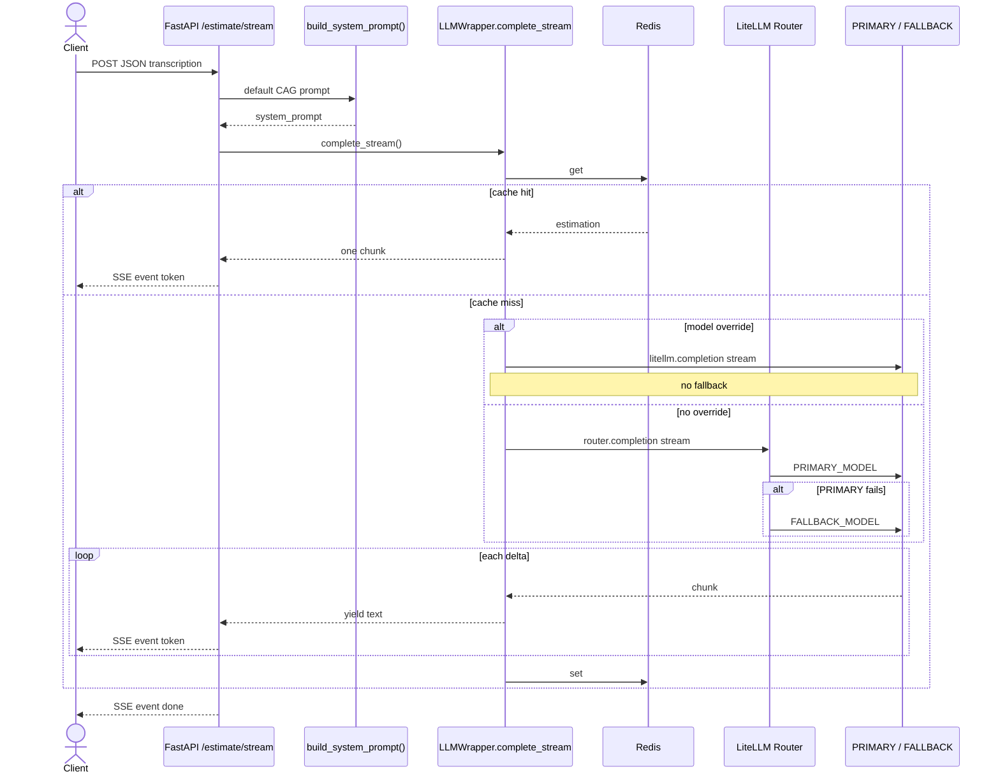
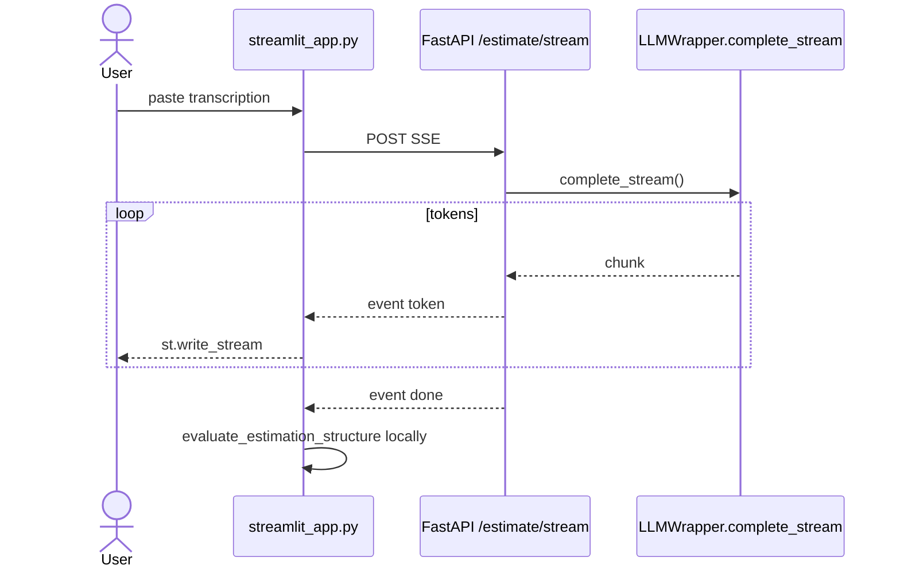

# Estimador CAG — Software estimation with AI

AI-powered software project estimation service using a **Cache Augmented Generation (CAG)** architecture.

The design and reference implementation this project follows come from the LiDR / Master **estimator** service (`ai-engineering-lidr/estimator`). This repo is a parallel student implementation with the same CAG approach.

## What is CAG and why use it

CAG (Cache Augmented Generation) injects relevant context directly into the LLM system prompt as static text. Here, reference estimations are inlined as examples — no vector database and no retrieval step.

That is a good first stage because:

- It is simple to implement and debug
- It needs no extra infrastructure (embeddings, vector stores)
- It works well when the context volume is small (a handful of examples)

Later modules of the Master are expected to evolve this kind of service toward **RAG** (Retrieval Augmented Generation) with a vector store when the example set grows.

## Requirements

- Python **3.11+**
- [uv](https://docs.astral.sh/uv/)
- An **API key** for OpenAI or Anthropic (matching `LLM_PROVIDER` in `.env`)

## Local setup

```bash
cd estimador-cag
uv sync
cp .env.example .env
# Edit .env and set the API key for your chosen provider
```

Run the API (same layout as the VS Code launch config: app package root is `src/`):

```bash
cd src
uv run uvicorn main:app --reload
```

Service: `http://localhost:8000`  
Swagger: `http://localhost:8000/docs` · ReDoc: `http://localhost:8000/redoc` · Health: `GET /health`

## Two streaming paths

They look similar. They are not the same pipe.

| Path | Entry | Transport | LLM |
|---|---|---|---|
| HTTP SSE | `POST /api/v1/estimate/stream` | Server-Sent Events | `LLMWrapper.complete_stream` → LiteLLM |
| Streamlit | `streamlit_app.py` | in-process iterator | `EstimationTokenStream` → OpenAI/Anthropic SDKs |

Streamlit does **not** call the SSE endpoint yet.

### HTTP SSE (`POST /api/v1/estimate/stream`)

Default CAG prompt only. No two-phase, no validation, no final JSON metrics.
Cache hit: one SSE token with the full text. Miss: live tokens, then store.

Browser demo: [http://localhost:8000/static/sse_demo.html](http://localhost:8000/static/sse_demo.html)



### Streamlit (HTTP SSE client)

Needs the API running. Validation is local regex on the finished text (SSE has no JSON footer).



## Project layout

```
estimador-cag/
├── src/
│   ├── main.py                 # FastAPI app, logging, CORS, /health
│   ├── config.py               # Pydantic Settings
│   ├── routers/estimations.py  # POST /estimate and /estimate/stream
│   ├── services/               # LLM + structural evaluation
│   ├── schemas/estimation.py   # Request / response models
│   └── context/examples.py     # CAG canonical examples
├── pyproject.toml
└── .env.example
```

# Notes

## (legacy-outdated) Install

cd $WORKSPACE_HOME/ai-engineering/session2/estimador-cag
uv venv .venv --python 3.12.12
source .venv/bin/activate
uv pip install --python .venv/bin/python -r requirements.txt

## Test

### FastAPI without streamming

curl -X POST http://localhost:8000/api/v1/estimate   -H "Content-Type: application/json"   -d '{
    "transcription": "En la reunión con el equipo de marketing, el cliente explicó que necesita una landing page con formulario de contacto, integración con su CRM actual (HubSpot), y una sección de blog con editor WYSIWYG. El plazo ideal sería tenerlo listo en 4 semanas. El diseño ya existe en Figma."
  }' -o salida.json

jq -r '.estimation' salida.json > estimacion-limpia.md

### FastAPI with streamming

curl -N -X POST http://localhost:8000/api/v1/estimate/stream \
  -H 'Content-Type: application/json' \
  -d '{"transcription": "We need a small CRM with auth, contacts and roles. MVP six weeks."}'

### Chat
# HTTP SSE client — API must already be running
uv run streamlit run streamlit_app.py
# In-process SDK stream — no FastAPI needed
uv run streamlit run streamlit_inprocess.py

### Browser
/static

## Improvements

### evaluation.py

  • bool(hours_match) / bool(cost_match) treats None as fail. If the table does not parse, those two checks drag the score down even though hours_match/cost_match stay None and
    no mismatch issue is logged. That is a harsh scorer, not a missing feature.
  • Costs are parsed with _to_int (digits only) while the schema types them as float. 1.234,56 vs 1,234.56 can go wrong the same way in both.
  • has_duration_section is true if the word week/weeks appears anywhere. Cheap heuristic. Same in both.

